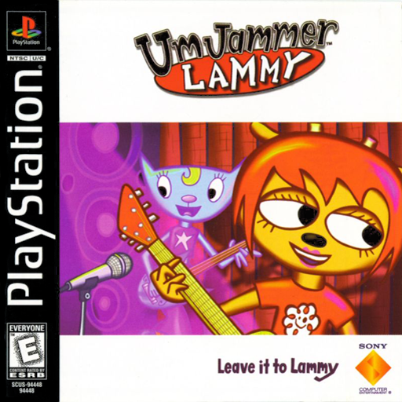
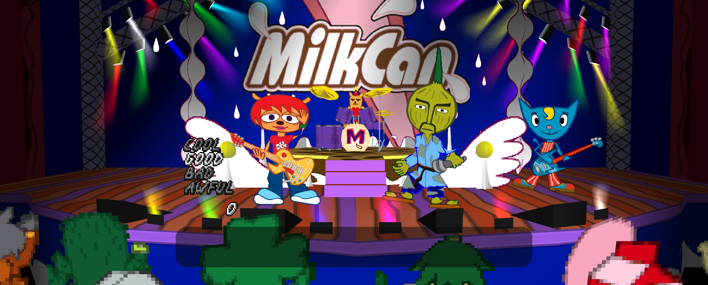
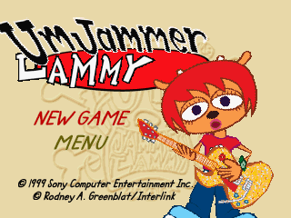

# Um Jammer Lammy Recompiled

  

Play **Um Jammer Lammy** on PC, with a controller or keyboard and adjustable rhythm timing for modern displays and audio setups.

An initial preview for the **US PlayStation version, SCUS-94448**, with Windows and Linux builds.

**[Download the initial release](https://github.com/mstan/UmJammerLammyRecomp/releases/tag/v0.1.0)** | [Supported disc](DISC.md)

## Rhythm Timing Assist

**This is the main mod in this project.** It lets you make the game's strict rhythm timing more forgiving and compensate for delay from your display, controller or sound system.

In the recomp launcher, open **Mods > Rhythm Timing Assist** and enable it. Start with latency compensation at **0 ms**. Adjust early and late tolerance independently, or set both to **60 ms** for maximum forgiveness. The game converts these values to musical ticks and caps each side at four extra ticks, so the window stays within neighbouring timing cells.

If your presses consistently register late, increase **Latency compensation** in small steps. Positive values judge your press earlier; negative values judge it later. Speakers, headphones, HDMI audio and wireless controllers can need different settings.

You still need the right buttons and the right musical pattern. The mod changes the timing check and local input timestamp; the game's music clock and scoring rules continue to run normally. Disable the mod for stock behaviour. It is disabled by default in a fresh installation.

## Display and loading

The default internal resolution is **1080p**. **Adaptive Widescreen** fits the gameplay view to your window; Mods also offers fixed **16:9**, **21:9**, and original **4:3**. Movies and 2D menus retain their original proportions. Change internal resolution in the launcher's graphics settings.

**Fast Resource Loading** is enabled by default. On the first launch it prepares a private cache from your own disc; later launches verify and reuse it. Stage textures, models and sound banks load from memory through a game-specific HLE adapter. Music and movie streams keep their original timing. Disable this mod for original loading.

## Getting started

1. Download the **windows-x64** or **linux-x64** ZIP from Releases and extract the whole folder. On Windows run `Um_Jammer_Lammy_Recompiled.exe`; on Linux run `./Um_Jammer_Lammy_Recompiled` (Ubuntu 24.04 or compatible).
2. Use your own **US SCUS-94448 disc image**, with its `.cue` and corresponding `.bin` together. Extract an archived dump before selecting it.
3. Open **Um Jammer Lammy Recompiled** and select your cue sheet in the launcher.
4. Configure your controller in **Controls**. A digital PlayStation pad is the initial controller mode. Keyboard controls are also available.
5. Enable **Rhythm Timing Assist** in **Mods**, choose your tolerance, and start the game.

The runtime audio buffer starts at **60 ms**. Timing compensation does not measure your physical display or speaker delay automatically; adjust it to your setup by playing.

The game disc and a retail PlayStation BIOS are not included. The project uses [psxrecomp](https://github.com/RetroPortingToolKit/psxrecomp) and [recomp-ui](https://github.com/RetroPortingToolKit/recomp-ui), with OpenBIOS available from the framework.

## Preview status

Controller gameplay and the new display/loading features have received an initial Windows playtest. Focused tests cover stock timing, wider windows, signed compensation and replay guards. A measured menu resource load fell from about **4.2 seconds to 0.2 seconds**, excluding first-launch cache preparation.

This remains an initial preview: full stage clears, duets, PaRappa mode and every widescreen scene have not been systematically checked. Linux receives build and launch checks; controller gameplay was validated on Windows.

If something feels wrong, report the stage, controller, audio output and your three timing settings. Useful examples are "Stage 1, DualSense over Bluetooth, PC speakers, offset 0 / early 60 / late 60."

## Screenshots

## Building and credits

Developers can follow [BUILDING.md](BUILDING.md). Disc files, generated game code, saves and analysis dumps stay local and are excluded from the public source repository.

Um Jammer Lammy is a game by NanaOn-Sha and Sony Computer Entertainment. This is an independent fan project. The US cover above comes from [libretro-thumbnails](https://thumbnails.libretro.com/Sony%20-%20PlayStation/Named_Boxarts/Um%20Jammer%20Lammy%20(USA).png); its provenance is recorded in [BOXART_SOURCE.txt](launcher_assets/img/BOXART_SOURCE.txt). Original artwork retains its owners' rights. Project code is licensed under [PolyForm Noncommercial 1.0.0](LICENSE); framework, UI and bundled assets retain their own licenses.
